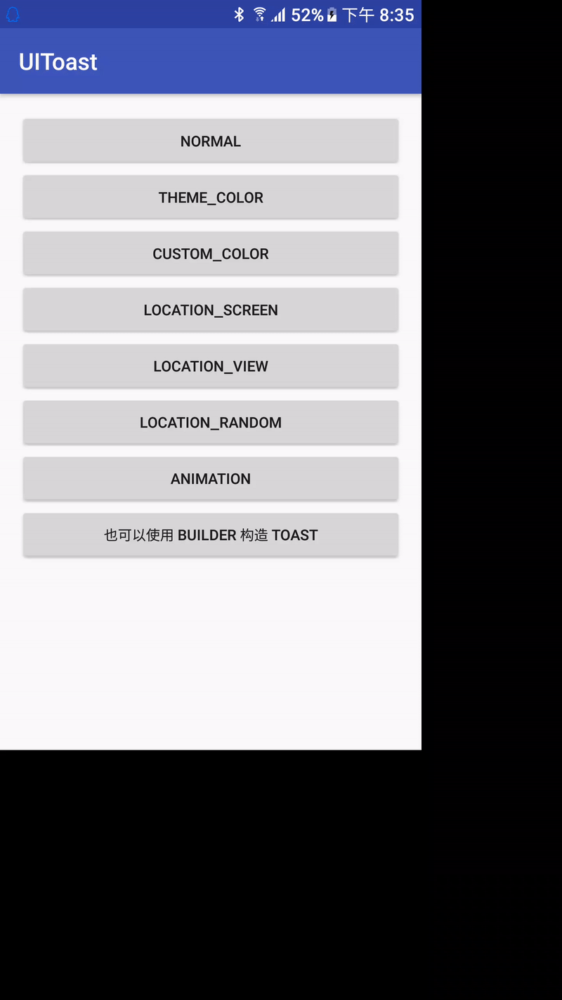

# UIToast
> 方便统一` Android APP Toast `风格



## 如何定制Toast全局样式?

### 第一步:
`values/colors.xml`
```
<color name="colorToastTextColor">@android:color/white</color>
<color name="colorToastBackgroundColor">@color/colorPrimaryDark</color>
```

### 第二步:
`values/styles.xml`
```
	<style name="AnimationToast">
        <item name="android:windowEnterAnimation">@anim/toast_fade_enter</item>
        <item name="android:windowExitAnimation">@anim/toast_fade_exit</item>
    </style>
```

### 第三步:
`UIToast.show...`
```
UIToast.showStyleToast(this,res.getString(R.string.theme_color));
```

## Gradle

```
compile 'com.didikee:uitoast:0.1.0'
```

## 功能
```
1. 自定义 Toast 字体颜色
2. 自定义 Toast 背景颜色
3. 自定义 Toast 展示位置(类似 Popupwindow 在某某下方(正下方水平居中)展示)
4. 自定义 Toast 进出场动画
```

## 代码调用示例:

1. 默认系统样式:
```
UIToast.showToast(this,res.getString(R.string.normal));
```
2. 主题样式
**你得先在xml配置好样式,包括颜色和动画,如果你不配置的话那默认会调用此libray中的样式**
```
UIToast.showStyleToast(this,res.getString(R.string.theme_color));
```
3. 自定义Toast 颜色
```
UIToast.showStyleToast(this,res.getString(R.string.custom_color),false, Color.GRAY,Color.GREEN, UIToast.NONE);
```
4. 在屏幕中展示Toast(示例以屏幕左上角为参考系)
```
UIToast.showLocationToast(this,res.getString(R.string.location_Screen),false,null, Gravity.START|Gravity.TOP,100,100);
```
5. 在任意` View `正下方展示Toast(默认是在正下方,水平居中)
```
UIToast.showLocationToast(this,res.getString(R.string.location_view),false,v, UIToast.NONE,0,0);
```
6. 自定义动画样式
```
UIToast.showBaseToast(this,res.getString(R.string.animation),true,UIToast.NONE,UIToast.NONE,null,UIToast.NONE,UIToast.NONE,UIToast.NONE,R.style.AnimationToast);
```

## 关于 `UIToast2`这个类的说明

去看源码的可以看到,方法重载什么的相对比较繁多,所以提供另一种写法:
例如,展示一个自定义动画,位置(带偏移量),文字颜色,背景色的`Toast`:
```
	DisplayMetrics displayMetrics2 = getResources().getDisplayMetrics();
                int widthPixels2 = displayMetrics2.widthPixels;
                int heightPixels2 = displayMetrics2.heightPixels;
                new UIToast2.Builder(this)
                        .setText("UIToast2 with Builder")
                        .setTextColor(Color.WHITE)
                        .setBackgroundColor(res.getColor(R.color.colorPrimaryDark))
                        .setAnimations(R.style.AnimationToast)
                        .gravity(Gravity.TOP | Gravity.CENTER_HORIZONTAL)
                        .offset(widthPixels2/4, (int) (heightPixels2*0.6))
                        .show();
```
